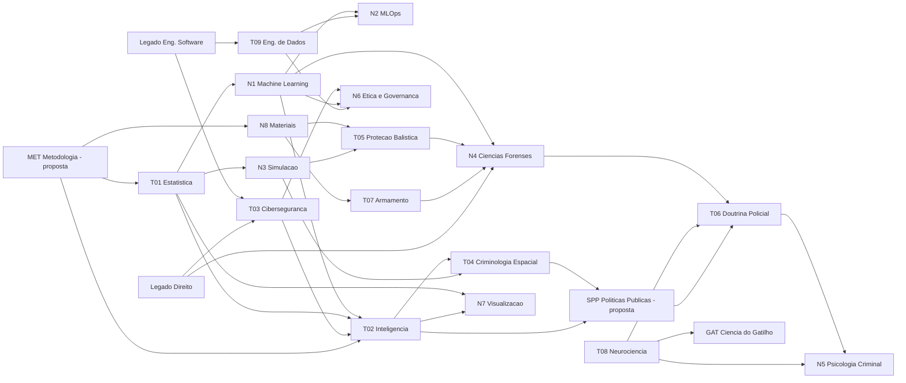
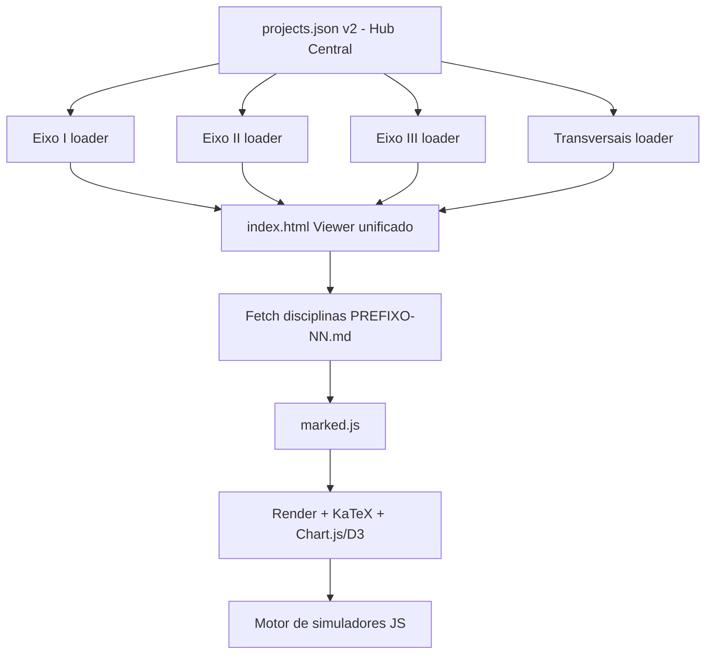

# 🗺️ Projeto Atlas 2.0 — Reestruturação Curricular Completa

> **Documento mestre de reestruturação.** Consolida o ecossistema existente, integra as trilhas legadas ao corpo ativo, cria um terceiro eixo, adiciona **8 novas trilhas** e expande as trilhas existentes com disciplinas correlatas — todas descritas com **disciplinas → tópicos → subtópicos**.
> Nível harmonizado: **Mestrado *Stricto Sensu* / Pós-Graduação de Alto Nível**.

---

## 0. Sumário Executivo da Reestruturação

O Atlas 1.0 sofria de três problemas estruturais que esta revisão corrige:

1. **Desequilíbrio de densidade** — trilhas como *Inteligência Analítica* (3 disciplinas) ou *Direito Digital* (4) estavam subdimensionadas frente a *Armamento* (27) ou *Neurociência* (22), quebrando a promessa de nível stricto sensu uniforme.
2. **Lacuna de IA/ML** — o eixo quantitativo tinha Estatística e Engenharia de Dados, mas **nenhuma trilha de Machine Learning, MLOps, Visão Computacional ou Simulação**, deixando um vão gigante entre "inferência clássica" e "sistemas inteligentes de produção".
3. **Trilhas legadas órfãs** — `software-engineer` (73), `direito-penal` (32) e `direito-operacional` (21) somavam 126 disciplinas fora do mapa de governança. Elas são **reintegradas** aqui.

### O que mudou (visão macro)

| Mudança | Antes (1.0) | Depois (2.0) |
|---|---|---|
| Eixos | 2 | **3** (+ Engenharia Física Aplicada) |
| Trilhas ativas | 9 | **18 publicadas** (9 expandidas + 8 novas + Ciência do Gatilho integrada) + 2 propostas (SPP, MET) |
| Trilhas legadas | 3 órfãs | 3 reintegradas e reorganizadas |
| Disciplinas catalogadas | ~203 | **337** (299 publicadas + 38 propostas de expansão) |
| Novas disciplinas propostas | — | **38** (pós-consolidação da auditoria; eram ~127 antes da eliminação de redundâncias) |

### As novas trilhas (8 publicadas + 2 propostas)

| # | Nova trilha | Eixo | Justificativa de correlação |
|---|---|---|---|
| N1 | Machine Learning e IA Aplicada | Quantitativo | Ponte natural entre Estatística e Inteligência Analítica |
| N2 | MLOps e Engenharia de Sistemas de IA | Quantitativo | Produtiza os modelos de N1 sobre a infra de Engenharia de Dados |
| N3 | Modelagem, Simulação e Otimização | Quantitativo | Formaliza os *simuladores* que o próprio Atlas já usa (TCL, RTM, Tate) |
| N4 | Ciências Forenses (Perícia Criminal) | Jurídico-Forense | Núcleo pericial que faltava entre Doutrina Policial e Inteligência |
| N5 | Psicologia Criminal e Análise Comportamental | Jurídico-Forense | Complementa Neurociência Tática com o lado investigativo/vitimológico |
| N6 | Ética, Governança e Responsabilidade em IA/Dados | Transversal | Fecha o ciclo LGPD/EU AI Act com auditoria algorítmica |
| N7 | Visualização de Dados e Storytelling Analítico | Transversal | Fundamenta os componentes Chart.js/D3 da própria plataforma |
| N8 | Ciência dos Materiais e Engenharia de Impacto | Físico Aplicado | Base física comum a Proteção Balística e Perícia |
| SPP | Segurança Pública Baseada em Evidências *(proposta — não publicada)* | Jurídico-Forense | Camada de decisão/política pública acima do nível tático |
| MET | Metodologia de Pesquisa Científica *(proposta — não publicada)* | Transversal | Espinha metodológica dos três eixos |

---

## 1. Arquitetura de Eixos (3 eixos)

```mermaid
graph TD
    ATLAS[Projeto Atlas 2.0] --> EIXO1[Eixo I · Quantitativo e Tecnológico]
    ATLAS --> EIXO2[Eixo II · Juridico-Operacional e Forense]
    ATLAS --> EIXO3[Eixo III · Engenharia Fisica Aplicada]
    ATLAS --> TRANSV[Trilhas Transversais]

    EIXO1 --> T01[T01 Estatistica p/ Ciencia de Dados]
    EIXO1 --> N1[N1 Machine Learning e IA Aplicada]
    EIXO1 --> N2[N2 MLOps e Sistemas de IA]
    EIXO1 --> T09[T09 Engenharia de Dados PPC]
    EIXO1 --> N3[N3 Modelagem, Simulacao e Otimizacao]
    EIXO1 --> LEG1[Legado Engenharia de Software]

    EIXO2 --> T02[T02 Inteligencia Analitica e Forense]
    EIXO2 --> T03[T03 Direito Digital e Ciberseguranca]
    EIXO2 --> T04[T04 Criminologia Espacial e GIS]
    EIXO2 --> T06[T06 Doutrina Policial e Pericia]
    EIXO2 --> N4[N4 Ciencias Forenses]
    EIXO2 --> N5[N5 Psicologia Criminal]
    EIXO2 --> T08[T08 Neurociencia Cognitiva e Tatica]
    EIXO2 --> GAT[GAT Ciencia do Gatilho]
    EIXO2 --> SPP[SPP Seg. Publica Baseada em Evidencias - proposta]
    EIXO2 --> LEG2[Legado Direito Penal + Operacional]

    EIXO3 --> T05[T05 Protecao Balistica]
    EIXO3 --> T07[T07 Engenharia de Armamento]
    EIXO3 --> N8[N8 Ciencia dos Materiais e Impacto]

    TRANSV --> N6[N6 Etica e Governanca de IA]
    TRANSV --> N7[N7 Visualizacao de Dados]
    TRANSV --> MET[MET Metodologia de Pesquisa - proposta]
```

**Convenção de IDs (nova):** cada disciplina passa a usar prefixo de trilha + número sequencial — ex.: `EST-04`, `ML-07`, `FOR-03`. Isso elimina colisões de `D01` entre trilhas e facilita o grafo de pré-requisitos no `projects.json`. O campo legado `Dxx` permanece como *alias* no cabeçalho durante a migração.

---

## 2. EIXO I — Quantitativo e Tecnológico

### 📈 T01 · Estatística para Ciência de Dados em Python
*Expansão: 11 → 20 disciplinas (pós-consolidação). Domínios: Fundamentos → Inferência → Modelagem → Causalidade → Aplicação.*

**Disciplinas existentes (mantidas, IDs `D01.01–D05.02`):** Medidas de Tendência Central, Dispersão e Forma · Análise Gráfica e Visualização de Distribuições · Probabilidade Condicional, Teorema de Bayes e Variáveis Aleatórias · Distribuições de Probabilidade e TCL · Amostragem, Estimação e Intervalos de Confiança · Testes de Hipóteses Paramétricos · Testes de Hipóteses Não-Paramétricos · Regressão Linear Simples e Múltipla · Regressão Logística e GLM · Métodos Multivariados e Redução de Dimensionalidade · Testes A/B, Múltiplos Testes e Causalidade.

#### EST-12 · Estatística Bayesiana e Inferência via MCMC 🆕
- **Fundamentos bayesianos** — teorema de Bayes, priori/verossimilhança/posteriori, conjugação, priors informativos vs. não-informativos.
- **Amostragem** — Metropolis-Hastings, Gibbs, Hamiltonian Monte Carlo, NUTS.
- **Ferramental** — PyMC, diagnóstico de convergência (R-hat, ESS, trace plots).
- **Aplicação** — A/B bayesiano, hierarquia parcial de *pooling*, decisão sob incerteza.

#### EST-13 · Séries Temporais e Modelos Dinâmicos 🆕
- **Decomposição** — tendência, sazonalidade, resíduo, STL.
- **Modelos clássicos** — AR, MA, ARIMA, SARIMA, estacionariedade e ADF.
- **Volatilidade** — ARCH/GARCH, heterocedasticidade condicional.
- **Previsão moderna** — Prophet, ETS, backtesting e janelas deslizantes.

#### EST-14 · Inferência Causal 🆕
*(Aprofunda o recorte causal de `D05.02`; os métodos quase-experimentais daqui são pré-requisito de SPP-02.)*
- **Estrutura** — DAGs, critério de *backdoor*, do-calculus (Pearl).
- **Métodos observacionais** — *propensity score*, IPW, matching.
- **Quase-experimentos** — Diferenças-em-Diferenças, Regressão Descontínua, Variáveis Instrumentais.

#### EST-15 · Desenho de Experimentos (DOE) 🆕
- **Fatoriais** — completos, fracionados, confundimento.
- **Superfície de resposta** — otimização, *central composite design*.
- **Poder e tamanho amostral** — cálculo de poder, MDE.

#### EST-16 · Métodos de Reamostragem 🆕
- Bootstrap (percentil, BCa), Jackknife, testes de permutação, validação por reamostragem.

#### EST-17 · Estatística Robusta e Não-Paramétrica 🆕
- M-estimadores, medianas/quantis, Wilcoxon/Mann-Whitney/Kruskal-Wallis, kernels de densidade (KDE).

#### EST-18 · Análise de Sobrevivência 🆕
- Kaplan-Meier, log-rank, riscos proporcionais de Cox, censura e truncamento.

#### EST-19 · Modelos Hierárquicos e Multinível 🆕
- Efeitos fixos vs. aleatórios, *shrinkage*, aninhamento, ICC.

#### EST-20 · Econometria 🆕
- **Modelagem de dados em painel** — efeitos fixos, efeitos aleatórios, estimador de primeiras diferenças.
- **Modelos estruturais e GMM** — Método dos Momentos Generalizado (GMM), equações simultâneas, identificação e sobreidentificação (teste de Sargan/Hansen).
- **Ponte causal-séries temporais** — modelos VAR causais, teste de causalidade de Granger, cointegração e VEC (Vector Error Correction).

### 🤖 N1 · Machine Learning e IA Aplicada 🆕 *(NOVA TRILHA)*
*Ponte entre Estatística (T01) e Inteligência Analítica (T02). ~11 disciplinas. Simuladores sugeridos: fronteira de decisão interativa, curva ROC/AUC ao vivo, gradient descent visual.*

#### ML-01 · Fundamentos de Aprendizado Supervisionado
- **Enquadramento** — viés-variância, sobreajuste, regularização L1/L2, validação cruzada.
- **Modelos base** — kNN, árvores de decisão, SVM (kernels).
- **Avaliação** — matriz de confusão, ROC/AUC, precisão-revocação, calibração.

#### ML-02 · Aprendizado Não-Supervisionado e Representação
- Clustering avançado, detecção de anomalias, *autoencoders* (conceitual), *embeddings*.

#### ML-03 · Ensembles e Gradient Boosting
- Bagging, Random Forest, boosting (AdaBoost, XGBoost, LightGBM, CatBoost), *stacking*, importância de atributos (permutação, SHAP).

#### ML-04 · Redes Neurais e Deep Learning
- Perceptron multicamadas, retropropagação, otimizadores (SGD, Adam), regularização (dropout, batchnorm), CNNs e RNNs (fundamentos).

#### ML-05 · Visão Computacional
- **Fundamentos** — convoluções, *feature maps*, aumento de dados.
- **Arquiteturas** — ResNet, detecção (YOLO/Faster-RCNN conceitual), segmentação.
- **Aplicação forense** — reconhecimento de padrões, OCR, análise de imagens (ligação com N4/T02).

#### ML-06 · Processamento de Linguagem Natural e LLMs
- Tokenização, *embeddings*, atenção e Transformers, *fine-tuning* vs. *prompting*, RAG (conceitual), avaliação de LLMs.

#### ML-07 · Previsão com ML e Séries Temporais
- Features temporais, modelos de janela, *gradient boosting* para *forecasting*, modelos sequenciais.

#### ML-08 · Sistemas de Recomendação
- Filtragem colaborativa, fatoração de matrizes, conteúdo, avaliação (NDCG, MAP).

#### ML-09 · Aprendizado por Reforço
- MDPs, Q-learning, política vs. valor, *policy gradient* (conceitual), aplicações de decisão sequencial.

#### ML-10 · IA Generativa
- Modelos de difusão, GANs, geração condicional, riscos (deepfakes → conexão com N4/N6).

#### ML-11 · Interpretabilidade e IA Explicável (XAI)
- SHAP, LIME, *partial dependence*, *counterfactuals*, transparência para uso pericial/jurídico.

---

### ⚙️ N2 · MLOps e Engenharia de Sistemas de IA 🆕 *(NOVA TRILHA)*
*Produtiza N1 sobre a infra de T09. ~7 disciplinas.*

#### OPS-01 · Ciclo de Vida de Modelos (MLLC)
- Versionamento de dados/modelos (DVC, MLflow), reprodutibilidade, *experiment tracking*.

#### OPS-02 · Engenharia de Atributos e Feature Stores
- Consistência treino/serviço, *point-in-time correctness*, materialização online/offline.

#### OPS-03 · Serving e Inferência
- Batch vs. online, latência/throughput, quantização, *model registry*, APIs de inferência.

#### OPS-04 · Monitoramento e Deriva (Drift)
- *Data drift*, *concept drift*, monitoramento de desempenho, alarmes, *shadow deployment*.

#### OPS-05 · CI/CD para ML
- Pipelines automatizados, testes de modelo, *canary/blue-green*, reprovisionamento.

#### OPS-06 · LLMOps e Sistemas RAG
- Orquestração de LLMs, *vector databases*, avaliação contínua, guardrails, custo/observabilidade.

#### OPS-07 · Governança Operacional de Modelos
- *Model cards*, linhagem, auditoria, conformidade (ponte com N6).

### 🗄️ T09 · Engenharia de Dados (PPC) — *expandida*
*13 → 17 disciplinas (pós-consolidação). PPC publicado de arquitetura de dados; ganha camada de plataforma moderna.*

**Disciplinas existentes (mantidas, IDs `D01.01–D04.04`):** Modelagem e Arquitetura de Data Warehouse · Banco de Dados Relacional · Administração de Banco de Dados (DBA) · Governança de Dados · Big Data e Cloud Computing · Bancos Não-Relacionais (NoSQL) · Machine Learning (visão de engenharia — a teoria de modelos pertence à trilha N1) · Projeto de Processamento Distribuído · Tuning de Banco de Dados · Engenharia de Dados em Nuvem · DataOps, Orquestração e Automação · Data Mesh e Data Fabric · Projeto Final Integrador.

#### DE-14 · Processamento em Streaming e Tempo Real 🆕
- Kafka, semântica *exactly-once*, janelas (tumbling/sliding/session), *watermarks*, Flink/Spark Streaming.

#### DE-15 · Data Lakehouse e Formatos Abertos 🆕
- Parquet/ORC, Apache Iceberg/Delta/Hudi, *time travel*, *schema evolution*, camadas medalhão.

#### DE-16 · Qualidade e Observabilidade de Dados 🆕
- Great Expectations, testes de dados, linhagem, SLAs/SLOs de dados, detecção de anomalias em pipelines.

#### DE-17 · Captura de Mudanças e Integração 🆕
- CDC (Debezium), ELT vs. ETL, *reverse ETL*, ingestão incremental.

---

### 🎲 N3 · Modelagem, Simulação e Otimização Computacional 🆕 *(NOVA TRILHA)*
*Formaliza os simuladores que o Atlas já usa (TCL, RTM, Tate-Alekseevskii, I de Moran). ~7 disciplinas.*

#### SIM-01 · Métodos de Monte Carlo
- Amostragem por importância, *variance reduction*, integração estocástica, propagação de incerteza.

#### SIM-02 · Simulação Baseada em Agentes (ABM)
- Autômatos celulares, modelos de mobilidade/criminalidade (ponte com T04), emergência.

#### SIM-03 · Otimização Matemática
- Linear/inteira (simplex, *branch-and-bound*), não-linear (gradiente, KKT), convexidade.

#### SIM-04 · Metaheurísticas
- Algoritmos genéticos, *simulated annealing*, PSO, *ant colony*, *tabu search*.

#### SIM-05 · Teoria dos Jogos Computacional
- Equilíbrio de Nash, jogos de rede, o **Paradoxo de Braess** (já explorado no Atlas), mecanismos.

#### SIM-06 · Simulação de Eventos Discretos (DES)
- Filas, chegadas/serviços, SimPy, dimensionamento de recursos operacionais.

#### SIM-07 · Métodos Numéricos e EDPs
- Diferenças finitas/elementos finitos (introdução), estabilidade, ponte com T05/N8 (hidrocódigos).

---

### 💻 Legado-Eixo-I · Engenharia de Software (reintegrada)
*73 disciplinas legadas. Reorganizada em 6 domínios e conectada às trilhas de dados/IA.*

- **Domínio A — Fundamentos:** Algoritmos e Estruturas de Dados · Complexidade · Paradigmas · Teoria da Computação.
- **Domínio B — Arquitetura:** Padrões de Projeto · Microsserviços · DDD · Arquitetura Hexagonal · Event-Driven.
- **Domínio C — Qualidade:** Testes (unidade/integração/e2e) · TDD/BDD · Code Review · Refatoração.
- **Domínio D — Infra/DevOps:** Contêineres · Kubernetes · IaC · CI/CD · Observabilidade *(interliga com N2)*.
- **Domínio E — Sistemas:** Redes · SO · Bancos de Dados · Segurança de Aplicações *(interliga com T03)*.
- **Domínio F — Prática:** APIs (REST/GraphQL) · Frontend · Mensageria · Performance.

> 🔗 **Correlação nova:** disciplinas de *Segurança de Aplicações* e *Observabilidade* passam a ser **pré-requisitos cruzados** de T03 (Cibersegurança) e N2 (MLOps), respectivamente.

---

## 3. EIXO II — Jurídico-Operacional e Forense

### 🔍 T02 · Inteligência Analítica e Forense de Dados — *expandida*
*3 → 10 disciplinas (pós-consolidação). Era a trilha mais subdimensionada; ganha o ciclo de inteligência completo.*

**Existentes (mantidas, IDs `D01.01–D01.03`):** Análise de Redes e Vínculos em Grafos (`NetworkX`) · OSINT Avançado e Coleta de Inteligência Digital · NLP Forense e Mineração de Textos Policiais (TF-IDF/cosseno).

#### IAF-04 · Ciclo de Inteligência e Estrutura Analítica 🆕
- Direção → coleta → processamento → análise → disseminação; requisitos de inteligência; níveis (estratégico/operacional/tático).

#### IAF-05 · SOCMINT e Análise de Redes Sociais Criminais 🆕
- Grafos sociais, detecção de comunidades (Louvain), *key players*, difusão e influência.

#### IAF-06 · Blockchain Forensics e Rastreio de Criptoativos 🆕
- *Heurísticas de clustering* de carteiras, *taint analysis*, *mixers/tumblers* (conceito), *on-chain analytics*.

#### IAF-07 · Detecção de Fraude e Anomalias 🆕
- Regras vs. ML, *isolation forest*, Benford, redes de fraude, *feature engineering* transacional.

#### IAF-08 · Análise de Registros de Comunicação (CDR/ERB) 🆕
- Metadados de chamadas, triangulação por ERB, mobilidade, correlação temporal (garantidas ressalvas legais → T03).

#### IAF-09 · Fusão de Dados e Resolução de Entidades 🆕
- *Record linkage*, *deduplication*, *entity resolution* probabilística, ontologias.

#### IAF-10 · Análise de Hipóteses Concorrentes (ACH) e Vieses 🆕
- Método de Heuer, vieses cognitivos do analista, matriz de evidências, *red teaming* analítico.

---

### 🔒 T03 · Direito Digital e Cibersegurança — *expandida*
*4 → 12 disciplinas (pós-consolidação).*

**Existentes (mantidas, IDs `D02.01–D02.04`):** Criptoanálise e Cadeia de Custódia de Evidências Digitais (`hashlib`) · Crimes Cibernéticos e Invasão de Dispositivos na Jurisprudência · Governança, Privacidade e Auditoria Algorítmica de IA · Marco Regulatório da Segurança Digital e IA.

#### DIG-05 · LGPD Avançada e Encarregado (DPO) 🆕
- Bases legais, ANPD, relatório de impacto (RIPD), incidentes e notificação, transferência internacional.

#### DIG-06 · Marco Civil e Regulação de Plataformas 🆕
- Neutralidade, responsabilidade de intermediários, guarda de registros, PL das Fake News (debate aberto).

#### DIG-07 · Computação Forense 🆕
*(Recorte técnico-pericial de aquisição e análise; a cadeia de custódia jurídica permanece em `D02.01`.)*
- Aquisição forense (dead/live), *imaging*, forense mobile/cloud, *anti-forensics*, laudo pericial.

#### DIG-08 · Resposta a Incidentes e SOC 🆕
- Ciclo NIST (identificar→conter→erradicar→recuperar), *playbooks*, SIEM, triagem, *lessons learned*.

#### DIG-09 · Cyber Threat Intelligence 🆕
- IoCs, TTPs, MITRE ATT&CK, *diamond model*, *kill chain*, atribuição.

#### DIG-10 · Criptografia Aplicada 🆕
*(Perspectiva construtiva de protocolos; complementa a criptoanálise de `D02.01`.)*
- Simétrica/assimétrica, funções hash, assinatura digital, PKI/ICP-Brasil, TLS, *zero-knowledge* (conceito).

#### DIG-11 · Segurança Ofensiva Ética — Metodologia e Governança 🆕
- Escopo e autorização legal, metodologias (PTES/OWASP), gestão de vulnerabilidades e *disclosure* responsável, *red vs. blue team* (nível de governança e ciclo de defesa — sem conteúdo operacional de exploração).

#### DIG-12 · GRC e ISO/IEC 27001 🆕
- **Governança, Risco e Conformidade (GRC)** — frameworks de GRC em segurança da informação, modelagem de ameaças e apetite ao risco.
- **Normas ISO/IEC 27001 e 27002** — estrutura do SGSI (Sistema de Gestão de Segurança da Informação), controles de segurança, declaração de aplicabilidade (SoA).
- **Auditoria de conformidade** — planejamento e execução de auditorias internas, conformidade regulatória (LGPD/cyber-segurança), tratamento de não-conformidades.

---

### 🗺️ T04 · Criminologia Espacial e Geoprocessamento (GIS) — *expandida*
*4 → 8 disciplinas (pós-consolidação).*

**Existentes (mantidas, IDs `D03.01–D03.04`):** Análise Espacial de Crime e Hotspots com GIS · Geoestatística e Autocorrelação Espacial (I de Moran, `PySAL`) · Modelagem Espaço-Temporal e Predição Criminal · Inteligência Geoespacial para Segurança Pública.

> 🔗 O recorte **ético** do policiamento preditivo é tratado em N6 (GOV-02/GOV-04); **sensoriamento por drones e vídeo-análise pericial** é trilha-dona N4 (FOR-12).

#### GEO-05 · Criminologia Ambiental e CPTED 🆕
- Prevenção pelo desenho urbano, vigilância natural, controle de acesso, territorialidade.

#### GEO-06 · Teoria das Atividades Rotineiras e Padrão Criminal 🆕
- Triângulo do crime (alvo/ofensor/guardião), *awareness space*, *journey to crime*.

#### GEO-07 · Perfil Geográfico (Geographic Profiling) 🆕
- Modelo de Rossmo, *distance decay*, âncora, priorização de suspeitos.

#### GEO-08 · Mobilidade Urbana e Oportunidade Criminal 🆕
- Redes de transporte, fluxo populacional, *big data* de mobilidade, exposure espacial.

---

### 🚔 T06 · Doutrina Policial e Perícia Forense — *refinada*
*19 → 21 disciplinas (pós-consolidação). Núcleo mantido; adicionadas 2 disciplinas de doutrina contemporânea e reposicionadas as periciais para N4.*

> 🔗 **Uso Diferenciado da Força** e **Gestão de Crises** são cobertos pelo legado Direito Operacional (`D04.01`, `D08.02`, `D06.02`) — não duplicados aqui.

**Núcleo doutrinário mantido:** Cadeia de Custódia · Local de Crime (preservação) · Procedimentos Operacionais Padrão · Abordagem e Revista · Balística Forense (tradicional) · Fotografia Pericial · Táticas de Patrulha · Gestão de Ocorrências · entre outras.

#### DPF-20 · Investigação Criminal Baseada em Evidências 🆕
- Método hipotético-dedutivo, gestão de casos, *cold cases*, integração inteligência-investigação (ponte com T02).

#### DPF-21 · Direitos Humanos e Policiamento 🆕
- Protocolos internacionais (Princípios de Minnesota), controle externo, accountability, policiamento orientado à comunidade.

---

### 🔬 N4 · Ciências Forenses (Perícia Criminal) 🆕 *(NOVA TRILHA)*
*Núcleo pericial que estava disperso. 12 disciplinas (11 publicadas + 1 proposta). Foco investigativo/post-facto e laudo técnico.*

#### FOR-01 · Medicina Legal
- Tanatologia, cronotanatognose, lesões e mecanismos, necropsia médico-legal, identificação.

#### FOR-02 · Toxicologia Forense
- Farmacocinética, matrizes biológicas, triagem/confirmação (imuno/cromatografia), interpretação de doses.

#### FOR-03 · Genética Forense (DNA)
- STRs, eletroforese capilar, bancos de perfis, mistura e *likelihood ratio*, DNA de contato.

#### FOR-04 · Papiloscopia
- Sistemas de classificação, minúcias, AFIS, revelação de impressões latentes.

#### FOR-05 · Documentoscopia e Grafotécnica
- Autenticidade documental, tintas e suportes, análise de escrita, falsificações.

#### FOR-06 · Química Forense
- Identificação de substâncias, análise instrumental (GC-MS, FTIR), vestígios químicos, análise de resíduos *pós-evento* (perícia de causa e origem, sem síntese).

#### FOR-07 · Entomologia Forense
- Sucessão entomológica, estimativa de IPM, coleta e criação de amostras.

#### FOR-08 · Antropologia Forense
- Determinação de sexo/idade/estatura em restos ósseos, trauma ósseo, reconstrução facial.

#### FOR-09 · Local de Crime e Vestígios
- Isolamento, cadeia de custódia, coleta e acondicionamento, reconstrução de eventos.

#### FOR-10 · Perícia de Incêndios e Explosões (Causa e Origem)
- Padrões de queima, ponto de origem, análise *post-facto* de sinistros, laudo de causa (abordagem investigativa, não operacional).

#### FOR-11 · Perícia em Acidentes de Trânsito
- Cinemática do impacto, vestígios de frenagem, reconstrução de colisão, cálculo de velocidade.

#### FOR-12 · Sensoriamento, Drones e Vídeo-análise 🆕 *(proposta; trilha-dona do tema — absorve a antiga GEO-13)*
- **Reconstituição 3D por drones** — nuvens de pontos fotogramétricas de locais de acidente ou crime, georreferenciamento de vestígios macroscópicos.
- **Análise pericial de vídeo** — autenticidade de vídeo (verificação de edição/deepfake), realce de imagens de baixa qualidade, detecção de movimento e cronometragem de quadros.
- **Custódia digital de provas de vídeo** — aplicação de hash criptográfico na captura de bodycams e gravação CFTV, proteção contra vazamentos e quebra de custódia.

---

### 🧩 N5 · Psicologia Criminal e Análise Comportamental 🆕 *(NOVA TRILHA)*
*Complementa T08 (Neurociência) com o lado investigativo e vitimológico. ~6 disciplinas.*

#### PSI-01 · Perfilação Criminal (Criminal Profiling)
- Abordagens indutiva vs. dedutiva, *modus operandi* vs. assinatura, análise de cena comportamental, limites científicos e críticas.

#### PSI-02 · Psicopatologia Forense
- Transtornos de personalidade, imputabilidade, avaliação de risco, psicopatia (PCL-R).

#### PSI-03 · Entrevista e Interrogatório (Métodos Éticos)
- Modelo PEACE, entrevista cognitiva, detecção de engano (limites científicos), confissões falsas.

#### PSI-04 · Vitimologia
- Tipologias de vítima, ciclo de vitimização, revitimização, apoio e proteção.

#### PSI-05 · Psicologia de Multidões e Comportamento Coletivo
- Dinâmica de aglomerações, pânico, contágio comportamental, gestão de eventos de massa.

#### PSI-06 · Psicologia do Testemunho
- Memória e sugestionabilidade, reconhecimento de suspeitos, confiabilidade de relatos, *lineups*.

---

### 🧠 T08 · Neurociência Cognitiva e Tática — *expandida*
*22 → 23 disciplinas (pós-consolidação). Já robusta; estresse agudo, decisão sob pressão, percepção de ameaça e psicofisiologia da performance já existem no acervo (`D02.01`, `D02.02`, `D03.01`, `D05.01`, `D05.06`) — ganha apenas o tema inédito de sono/fadiga.*

**Núcleo mantido:** Neuroanatomia Funcional · Sistema Nervoso Autônomo · Resposta ao Estresse (eixo HPA) · Percepção e Atenção · Memória · Sistema Visual · Fisiologia do Medo · entre outras.

#### NEU-23 · Fadiga, Sono e Ritmo Circadiano 🆕
- Privação de sono e desempenho, turnos, débito de sono, recuperação.

### 🚔 SPP · Segurança Pública Baseada em Evidências e Políticas Públicas 🆕 *(NOVA TRILHA — proposta, ainda não publicada)*
*Eixo II. Camada de DECISÃO que falta acima do nível tático. ~5 disciplinas. Pré-requisitos cruzados: T04 (criminologia espacial) e T02 (inteligência).*

#### SPP-01 · Evidence-Based Policing
- **Fundamentos de EBP** — história, conceitos de policiamento baseado em evidências (Sherman), a matriz de policiamento baseado em evidências (Center for Evidence-Based Crime Policy).
- **Hierarquia de evidências em segurança** — ensaios controlados aleatórios (RCTs) vs. estudos observacionais, o papel das revisões sistemáticas de policiamento.
- **Implementação e resistência tática** — transição da experiência/tradição para a tomada de decisão orientada por dados científicos, transposição de evidências para o policiamento de patrulha e policiamento comunitário.

#### SPP-02 · Avaliação de Impacto de Intervenções
*(Aplica à segurança pública os métodos formalizados em EST-14 · Inferência Causal.)*
- **Desenhos experimentais (RCTs)** — aleatorização em segurança pública, ensaios de policiamento de hot-spots, desafios éticos e operacionais da aleatorização policial.
- **Desenhos quase-experimentais** — Diferenças-em-Diferenças (DiD), regressão descontínua (RDD), pareamento por escore de propensão (propensity score matching - PSM) aplicados a políticas de segurança.
- **Construção do contrafactual** — o que teria acontecido com a taxa de criminalidade sem a intervenção, controle de deslocamento do crime e difusão de benefícios.

#### SPP-03 · Análise Custo-Benefício em Segurança
- **Valoração econômica do crime** — custos tangíveis e intangíveis do crime para as vítimas, sistema de justiça criminal e sociedade.
- **Modelagem de custo-benefício** — estimativa de ROI (Retorno sobre Investimento) de programas de policiamento preventivo e repressivo, custo-efetividade comparativa de estratégias de redução de homicídios.
- **Tomada de decisão sob restrição orçamentária** — alocação ótima de recursos policiais escassos, eficiência econômica na aquisição de tecnologias e efetivo policial.

#### SPP-04 · Indicadores e Gestão Orientada a Dados
- **Desenho de indicadores de desempenho** — métricas de atividade (tempo de resposta, prisões) vs. métricas de impacto (redução de vitimização, medo do crime, confiança pública).
- **Dashboards de gestão estratégica** — design de salas de situação, fluxos de reporte COMPSTAT, governança de dados criminais em tempo real.
- **Metas e incentivos alinhados** — desdobramento de metas de redução criminal, accountability de comandantes locais, prevenção de manipulação estatística de ocorrências.

#### SPP-05 · Prevenção, Dissuasão Focada e Desenho de Políticas
- **Teorias de dissuasão focada (focused deterrence)** — policiamento de agressores crônicos (pulling levers), intervenções focadas em gangues e mercados abertos de drogas.
- **Policiamento de problemas (POP)** — o modelo SARA (Scanning, Analysis, Response, Assessment) aplicado a vulnerabilidades persistentes.
- **Desenho e ciclo de políticas públicas** — formulação, monitoramento contínuo, avaliação de impacto ex-post e institucionalização de programas de prevenção.

---

### ⚖️ Legado-Eixo-II · Direito Penal e Direito Operacional (reintegrados)
*53 disciplinas legadas (32 + 21). Reorganizadas e conectadas às trilhas forenses/digitais.*

- **Direito Penal — Parte Geral:** Teoria do Crime · Culpabilidade · Tipicidade · Ilicitude · Concurso · Penas.
- **Direito Penal — Parte Especial:** Crimes contra a pessoa/patrimônio/administração · Legislação especial · Crimes cibernéticos *(interliga com T03)*.
- **Direito Processual Penal:** Prova · Cadeia de custódia processual · Nulidades · Medidas cautelares.
- **Direito Operacional:** Legalidade da ação policial · Uso da força e legítima defesa · Abordagem · Prisão em flagrante · Garantias fundamentais.

> 🔗 **Correlação nova:** *Teoria da Prova* e *Cadeia de Custódia Processual* tornam-se pré-requisitos jurídicos das trilhas N4 (Forense) e T02 (Inteligência), garantindo admissibilidade do que é tecnicamente produzido.

---

## 4. EIXO III — Engenharia Física Aplicada

### 🛡️ T05 · Engenharia de Proteção Balística — *expandida*
*4 → 6 disciplinas (pós-consolidação). Foco defensivo: ciência de materiais de blindagem e normas.*

**Existentes (mantidas, IDs `D04.01–D04.04`):** Dinâmica do Impacto Hiperveloz e Novos Compósitos · Simulação e Modelagem Computacional de Trajetória e Penetração (Tate-Alekseevskii, FEM/hidrocódigos, Johnson-Cook) · Materiais para Blindagem Balística · Ensaios, Normas e Avaliação de Desempenho (NIJ/NBR/V50).

> 🔗 A mecânica do dano fundamental (ondas de tensão, modos de falha, *strain rate*) é trilha-dona N8 (MAT-02/MAT-04).

#### BAL-05 · Trauma por Trás da Blindagem (Backface) 🆕
- Deformação em plastilina (BFS), critério de trauma, avaliação biomecânica (perspectiva de proteção).

#### BAL-06 · Blindagem Veicular e Arquitetural 🆕
- Níveis de proteção, blindagem opaca/transparente, projeto de sistemas, requisitos normativos.

---

### 🔫 T07 · Engenharia de Armamento e Balística — *catálogo acadêmico (reorganizado)*
*27 disciplinas. Mantida no nível de **catálogo teórico-acadêmico e regulatório** (como um programa de Engenharia de Armamento do IME). Escopo: física, metalurgia, regulação, confiabilidade e balística forense — **sem procedimentos de fabricação, dados de carga ou otimização de letalidade**.*

- **Domínio A — Balística Interna (teoria):** termodinâmica de propelentes (conceitual), pressão e conservação de energia, ciclo de operação.
- **Domínio B — Balística Externa:** aerodinâmica de projéteis, arrasto e estabilidade giroscópica, trajetória, efeitos ambientais.
- **Domínio C — Balística Terminal (perspectiva forense/proteção):** transferência de energia, cavidade, correlação com T05 e N4.
- **Domínio D — Metalurgia e Materiais:** ligas, tratamento térmico, fadiga, tolerância a falhas.
- **Domínio E — Sistemas e Confiabilidade:** teoria de mecanismos, tolerâncias, ensaios de confiabilidade, manutenção.
- **Domínio F — Fatores Humanos:** ergonomia, recuo e biomecânica, segurança de operação.
- **Domínio G — Regulação e Certificação:** normas do Exército (DFPC/SIGMA), R-105, rastreabilidade legal, tratados internacionais.
- **Domínio H — Balística Forense:** microcomparação, identificação de estrias, confronto balístico *(ponte direta com N4/FOR)*.

> ⚠️ **Nota de governança:** esta trilha permanece **descritiva e conceitual** — títulos de disciplina, física fundamental e enquadramento regulatório. Conteúdos operacionais de fabricação/otimização não integram o Atlas.

---

### 🧱 N8 · Ciência dos Materiais e Engenharia de Impacto 🆕 *(NOVA TRILHA)*
*Base física comum a T05 e T07, tratada de forma unificada e defensiva. ~6 disciplinas.*

#### MAT-01 · Estrutura e Propriedades dos Materiais
- Ligações, cristalografia, defeitos, diagramas de fase.

#### MAT-02 · Comportamento Mecânico
- Tensão-deformação, plasticidade, fratura, fadiga, fluência.

#### MAT-03 · Materiais Compósitos
- Matriz-reforço, laminados, regra das misturas, falha interlaminar.

#### MAT-04 · Dinâmica de Alta Taxa de Deformação
- Ondas de choque, equações de estado, comportamento sob impacto, Hugoniot.

#### MAT-05 · Ensaios e Caracterização
- Tração/dureza/impacto (Charpy), microscopia, análise fractográfica.

#### MAT-06 · Modelagem Constitutiva
- Johnson-Cook, modelos de dano, calibração experimental, integração com simulação (N3).

---

## 5. Trilhas Transversais

### 🧭 N6 · Ética, Governança e Responsabilidade em IA e Dados 🆕 *(NOVA TRILHA)*
*Fecha o ciclo de LGPD/EU AI Act com auditoria prática. Transversal a todo o Eixo I e II. ~6 disciplinas.*

#### GOV-01 · Ética Aplicada à IA
- Princípios (beneficência, autonomia, justiça), dilemas, ética de máquinas, frameworks (OECD, UNESCO).

#### GOV-02 · Justiça Algorítmica e Viés
- Métricas de fairness (paridade demográfica, *equalized odds*), *trade-offs* de impossibilidade, mitigação.

#### GOV-03 · Privacidade e Tecnologias de Preservação (PETs)
- Privacidade diferencial (ponte com DE), *federated learning*, anonimização, *k-anonymity*/l-diversity.

#### GOV-04 · Regulação Global de IA
- EU AI Act, NIST AI RMF, PL 2338 (Brasil), governança comparada, conformidade.

#### GOV-05 · Auditoria Algorítmica
- Metodologias de auditoria, *model/data cards*, testes de robustez, documentação de linhagem.

#### GOV-06 · Segurança e Alinhamento de Sistemas de IA
- Robustez adversarial, *red teaming* de modelos, *guardrails*, uso responsável de LLMs.

---

### 📊 N7 · Visualização de Dados e Storytelling Analítico 🆕 *(NOVA TRILHA)*
*Fundamenta os próprios componentes Chart.js/D3 da plataforma Atlas. ~5 disciplinas.*

#### VIZ-01 · Gramática dos Gráficos
- *Grammar of graphics*, codificação visual, percepção pré-atentiva, escalas.

#### VIZ-02 · Design de Dashboards
- Hierarquia visual, interatividade, *drill-down*, princípios de Tufte, *data-ink ratio*.

#### VIZ-03 · Visualização Geoespacial
- Mapas coropléticos, *heatmaps*, *bins* hexagonais, projeções (ponte com T04).

#### VIZ-04 · Visualização de Redes e Grafos
- Layouts de força, *edge bundling*, escalabilidade visual (ponte com T02/IAF).

#### VIZ-05 · Narrativa com Dados
- Estrutura narrativa, *scrollytelling*, comunicação de incerteza, ética da visualização.

### 📝 MET · Metodologia de Pesquisa Científica 🆕 *(NOVA TRILHA — proposta, ainda não publicada)*
*Espinha metodológica do programa. Transversal aos três eixos. ~5 disciplinas.*

#### MET-01 · Desenho de Pesquisa
- **Abordagens metodológicas** — pesquisa qualitativa, quantitativa e métodos mistos (Creswell); definição e delimitação do problema de pesquisa.
- **Hipóteses e variáveis** — formulação de hipóteses falseáveis (Popper), variáveis dependentes, independentes, moderadoras e de controle.
- **Validade do desenho** — ameaças à validade interna (seleção, maturação, histórico) e validade externa (generalização ecológica e populacional).

#### MET-02 · Revisão Sistemática e Meta-análise
- **Diretriz PRISMA** — protocolo PRISMA para revisões sistemáticas; estratégias de busca em bases bibliográficas (Scopus, Web of Science, PubMed, SciELO).
- **Processo de screening e seleção** — critérios de elegibilidade, fluxo de triagem, extração estruturada de dados e avaliação de viés de publicação (Funnel Plot).
- **Tamanho de efeito (Effect Size)** — métricas (d de Cohen, g de Hedges, razão de chances - Odds Ratio), heterogeneidade amostral ($I^2$) e modelagem de efeitos fixos vs. efeitos aleatórios.

#### MET-03 · Redação Científica e Normas
- **Estrutura IMRaD** — anatomia de artigos de alto impacto: Introdução, Método, Resultados e Discussão (IMRaD); escrita concisa e rigor científico.
- **Normas de formatação** — normas ABNT (associação de citações e referências) e estilo APA (American Psychological Association) para manuscritos acadêmicos.
- **Ferramentas de citação** — uso de gerenciadores de referências bibliográficas (Zotero, Mendeley), integridade de metadados e gestão de bibliografias.

#### MET-04 · Estatística para Pesquisa
- **Análise de poder amostral** — cálculo do tamanho de amostra ótimo (G*Power) baseado no poder estatístico ($1 - \beta$) e tamanho de efeito esperado.
- **Pré-registro e ciência aberta** — registro prévio de hipóteses e planos de análise (OSF - Open Science Framework) para mitigar viés de publicação.
- **P-hacking e HARKing** — identificação de práticas de p-hacking (manipulação de variáveis para forçar $p < 0.05$), HARKing (hipotetização após os resultados serem conhecidos) e o papel da reprodutibilidade científica.

#### MET-05 · Ética em Pesquisa
- **Sistema CEP/CONEP** — o papel dos Comitês de Ética em Pesquisa e da Comissão Nacional de Ética em Pesquisa, submissão na Plataforma Brasil.
- **Termo de Consentimento Livre e Esclarecido (TCLE)** — redação, aplicação, anonimização de participantes de pesquisa e ética com vulneráveis.
- **Integridade científica** — prevenção de plágio, autoplágio, fabricação e falsificação de dados; atribuição correta de coautorias e transparência de conflitos de interesse.

---

## 6. Matriz de Correlação entre Trilhas (grafo de pré-requisitos)

**Leitura do grafo:** N1 (ML) emerge como *hub* central do Eixo I — depende de Estatística e alimenta MLOps, Inteligência e Forense. N4 (Forense) é o *hub* do Eixo II, recebendo insumos de ML, Materiais e Armamento e entregando para Doutrina Policial. N6 (Ética) e N7 (Visualização) são conectores transversais que tocam ambos os eixos. GAT (Ciência do Gatilho) integra-se ao Eixo II como correlata de T08. SPP e MET permanecem propostas (sem pasta publicada) e não contam como trilhas ativas.

---

## 7. Diretrizes de Governança Curricular (CLAUDE.md 2.0)

Mantido o padrão de **14 elementos estruturais** do Atlas 1.0, com **3 refinamentos**:

- **§5 Conteúdo Programático** — para trilhas do Eixo I, a subseção *Aplicação Prática* deve incluir um **script Python executável e reprodutível** (com *seed* fixada) e, quando couber, o **simulador JS** correspondente.
- **§7 Jurisprudência** — para trilhas técnicas de IA (N1, N2, N6) passa a valer também para **regulação técnica** (normas ISO/IEC, NIST), não só tribunais.
- **§11 Estado da Arte** — obrigatório citar **pelo menos 1 debate aberto pós-2023** para trilhas de IA/dados, dado o ritmo do campo (verificar sempre a atualidade).

### Marcadores de escopo (novo)
Toda disciplina recebe um selo de escopo no cabeçalho: `🟢 Aberto` · `🟡 Conceitual/Acadêmico` (ex.: T07, partes de T05) · `🔴 Restrito` (conteúdo não catalogável). Trilhas do Eixo III operam majoritariamente em `🟡`, com foco defensivo, forense e regulatório.

---

## 8. Arquitetura da Plataforma (atualizada)

### Mudanças técnicas propostas
- **`projects.json` v2** — adicionar campos `eixo`, `prefixo`, `escopo`, `prereqs[]` e `simuladores[]` por trilha; permite renderizar o **grafo de pré-requisitos** direto na home.
- **IDs prefixados** — migrar de `Dxx` para `PREFIXO-NN` (com alias durante transição), eliminando colisão entre trilhas.
- **KaTeX** — somar ao stack (Tailwind + marked.js + Chart.js) para renderizar a fundamentação matemática densa exigida no §5.
- **Busca federada** — índice único cruzando as 17 trilhas por conceito/tag, não só por nome.
- **D3.js** — para os simuladores de grafo (T02) e geoespaciais (T04) que o Chart.js não cobre bem.

### Camada de Avaliação e Aprendizagem (v2.0)
Especificação conceitual para implementação de features de avaliação de aprendizagem:
- **Banco de Questões**: Cada disciplina conterá um conjunto de testes de múltipla escolha estruturados em seu arquivo de metadados, definindo perguntas, alternativas, resposta correta e justificativa teórica.
- **Algoritmo de Repetição Espaçada (SM-2)**: Sistema de estudo ativo. Após o aluno responder uma questão, ele classifica sua dificuldade de resposta de 0 a 5. O sistema recalcula o intervalo de revisão ($I$) usando a lógica clássica do SM-2:
  - Fator de Facilidade ($EF'$) modificado por: $EF' = f(EF, q)$ onde $q$ é a qualidade da resposta de 0 a 5.
  - Intervalos subsequentes aumentados se a resposta for correta, ou reiniciados se houver erro ($q < 3$).
- **Rastreamento de Progresso**: Controle local de progresso armazenado via `localStorage` do navegador para registrar disciplinas concluídas, pontuação acumulada em questionários e histórico de datas de revisão.
- **Trilhas Guiadas (Percursos)**: Percursos formativos unificados que cruzam múltiplas trilhas curriculares para formar perfis profissionais integrados:
  - *Percurso "Analista Forense de Dados"*: Estatística (`EST`) ──> Machine Learning (`ML`) ──> Inteligência Analítica (`IAF`) ──> Ciências Forenses (`FOR`).
  - *Percurso "Gestor de Segurança Evidências"*: Estatística (`EST`) ──> Modelagem e Simulação (`SIM`) ──> Criminologia Espacial (`GEO`) ──> Segurança Pública Baseada em Evidências (`SPP`).
  - *Percurso "Arquiteto de IA Responsável"*: Machine Learning (`ML`) ──> MLOps (`OPS`) ──> Direito Digital (`DIG`) ──> Ética e Governança de IA (`GOV`).
- **Campos adicionais em `projects.json` v2**:
  - `questoes`: Array contendo IDs das questões associadas à trilha.
  - `percursos`: Lista de percursos formativos transversais a que o projeto pertence.
  - `progresso`: Objeto para persistência local de taxa de conclusão e escore do aluno.

### Novos simuladores sugeridos (por trilha)
| Trilha | Simulador interativo |
|---|---|
| N1 ML | Fronteira de decisão + curva ROC/AUC ao vivo |
| N3 Simulação | Monte Carlo de π · Paradoxo de Braess (já existe) · ABM de mobilidade |
| T02 Inteligência | Grafo de vínculos com detecção de comunidades (D3) |
| T04 GIS | KDE de hotspots + I de Moran local interativo |
| N6 Ética | Comparador de métricas de *fairness* em dataset sintético |
| T05 Balística | Curva V50 e dissipação de energia por material |

---

## 9. Roadmap de Implementação

1. **Fase 1 — Migração estrutural:** ✔ `projects.json` v2 publicado e legadas reintegradas; **pendente** a migração de IDs `Dxx → PREFIXO-NN` nas 12 trilhas 1.0/legadas.
2. **Fase 2 — Eixo I de IA:** ✔ N1, N2 e N3 publicadas; **pendente** completar os 9 stubs de N1 (ML-02 a ML-10) no padrão de 14 elementos.
3. **Fase 3 — Densificação forense:** ✔ N4 e N5 publicadas; expansões de T02/T03 permanecem como propostas consolidadas (IAF-04..10, DIG-05..12).
4. **Fase 4 — Transversais:** ⚠ N6 e N7 publicadas apenas como stubs (11 ementas genéricas) — prioridade de densificação antes de qualquer disciplina nova.
5. **Fase 5 — Eixo III:** ✔ N8 publicada; selos `🟡` aplicados aos cabeçalhos de T07, GAT e T05 (D04.01/02).
6. **Auditoria contínua:** validação bibliográfica (§8 do padrão) e revisão do *Estado da Arte* a cada ciclo, dado o ritmo de IA.

---

## 10. Resumo Quantitativo Final

| Eixo | Trilhas publicadas | Disciplinas publicadas | Propostas de expansão | Total planejado |
|---|---|---|---|---|
| I · Quantitativo/Tecnológico | 6 (T01, N1, N2, T09, N3, +Legado SW) | 122 | 13 (EST: 9 · DE: 4) | 135 |
| II · Jurídico-Operacional/Forense | 10 (T02, T03, T04, T06, N4, N5, T08, GAT, +2 Legados Direito) | 129 | 23 (IAF: 7 · DIG: 8 · GEO: 4 · DPF: 2 · NEU: 1 · FOR: 1) | 152 |
| III · Engenharia Física Aplicada | 3 (T05, T07, N8) | 37 | 2 (BAL) | 39 |
| Transversais | 2 (N6, N7) | 11 | — | 11 |
| Trilhas propostas | 2 (SPP, MET — sem pasta publicada) | 0 | 10 (SPP: 5 · MET: 5) | 10 |
| **Total** | **21 publicadas + 2 propostas** | **299** | **48** | **347** |

## 11. Registro de Decisões da Auditoria de Consolidação (14/07/2026)

Nenhum conteúdo foi apagado sem realocação: as propostas abaixo foram **fundidas** em disciplinas já publicadas (que permanecem as donas do tema) ou **atribuídas** a uma única trilha.

| Decisão | Proposta eliminada | Destino (dono do tema) |
|---|---|---|
| Fundir | EST-14 Multivariada · EST-15 GLM | `D05.01` · `D04.02` (T01) |
| Fundir | IAF-05 OSINT · IAF-07 Vínculos · IAF-11 Text Mining | `D01.02` · `D01.01` · `D01.03` (T02) |
| Fundir | DIG-11 Crimes Cibernéticos · DIG-12 Regulação IA | `D02.02` · `D02.03`+`D02.04` (T03) |
| Fundir | GEO-07 Hotspots · GEO-10 Espaço-Temporal · GEO-11 Sensoriamento | `D03.01` · `D03.03` · `D03.04` (T04) |
| Realocar | GEO-09 Policiamento Preditivo e Ética | predição em `D03.03` (T04); recorte ético em GOV-02/GOV-04 (N6) |
| Atribuir | GEO-13 ≡ FOR-12 Sensoriamento/Drones/Vídeo | N4 (FOR-12, trilha-dona); T04 referencia |
| Fundir | BAL-05 Materiais · BAL-06 Normas · BAL-10 Simulação | `D04.03` · `D04.04` · `D04.02` (T05) |
| Realocar | BAL-07 Mecânica de Impacto e Dano | `D04.01` (T05) + MAT-02/MAT-04 (N8) |
| Fundir | DE-16 Modelagem Analítica · DE-17 Orquestração · DE-18 Data Mesh · DE-21 NoSQL | `D01.01` · `D04.02` · `D04.03` · `D02.03` (T09) |
| Realocar | DPF-20 Uso Diferenciado da Força · DPF-21 Gestão de Crises | Legado Direito Operacional (`D04.01`+`D08.02` · `D06.02`) |
| Fundir | NEU-23 Estresse Agudo · NEU-24 Decisão sob Pressão · NEU-25 Atenção sob Ameaça · NEU-27 Neuroplasticidade · NEU-28 Psicofisiologia | `D03.01` · `D05.06` · `D02.01` · `D02.02`+`D05.02` · `D05.01` (T08) |
| Diferenciar | DIG-07 e DIG-10 (vs. `D02.01`) · EST-14 Causal (vs. `D05.02`/SPP-02) · ML-07 (séries com ML) vs. EST-13 (séries clássicas) · GOV-03 PETs (formal) vs. T09 (implementação) | mantidas com nota de recorte |
| Integrar | Ciência do Gatilho (GAT) ao Eixo II | correlata de T08 (pré-req: `neurociencia-cognitiva`) |
| Marcar proposta | SPP · MET (sem pasta, fora de `projects.json`) | criação futura seguirá o "Padrão de um domínio" |

**Renumerações aplicadas (De → Para):** EST-16..22 → EST-14..20 · IAF-06/08/09/10/12/13 → IAF-05..10 · DIG-13/14 → DIG-11/12 · GEO-08/12 → GEO-07/08 · BAL-08/09 → BAL-05/06 · DPF-22/23 → DPF-20/21 · NEU-26 → NEU-23 · DE-19/20 → DE-16/17.

---

> **Próximo passo recomendado:** completar as **20 disciplinas-stub já publicadas** (ML-02..10, GOV-01..06, VIZ-01..05) no padrão de 14 elementos — nenhuma disciplina nova deve ser criada antes disso.
