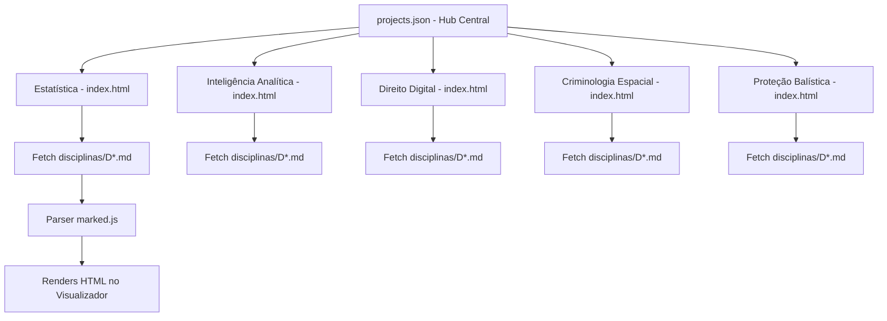

# Síntese Geral do Projeto Atlas — Hub de Conhecimento de Nível de Mestrado

O **Projeto Atlas** é uma infraestrutura educacional e conceitual de alta densidade desenvolvida em nível de pós-graduação *Stricto Sensu* (Mestrado Profissional/Acadêmico). Ele unifica de forma estruturada e interativa o conhecimento avançado em dois grandes eixos: o **Eixo Quantitativo/Tecnológico** e o **Eixo Jurídico-Operacional/Tático**.

Este documento atua como o mapa de referência e governança geral do projeto, consolidando todas as trilhas, a arquitetura da plataforma e as diretrizes curriculares estabelecidas.

---

## 1. Estatísticas Consolidadas do Atlas

* **Total de Projetos/Trilhas Ativos**: 9
* **Nível Acadêmico Harmonizado**: Mestrado *Stricto Sensu* (PPC - Projeto Pedagógico de Curso / Pós-Graduação Lato Sensu de Alto Nível)
* **Total de Disciplinas**: 203 disciplinas catalogadas
* **Estrutura de Visualização**: Sistema Web 100% estático (HTML/JS com Tailwind, Marked.js, Chart.js carregados via CDN) rodando em servidor local (Python HTTP server).

---

## 2. Mapa dos 9 Projetos / Trilhas Acadêmicas

### 📈 1. Estatística para Ciência de Dados em Python
* **Foco**: Fundamentação matemática, inferência clássica e modelagem estatística aplicada a grandes volumes de dados.
* **Escopo**: 11 disciplinas em 5 domínios pedagógicos.
* **Simuladores Integrados**: Teorema Central do Limite (TCL), Regressão Linear Ordinária (OLS) interativa e Testes A/B (Z-Score/P-Valor).
* **Diretório**: [estatistica-dados/](file:///C:/Users/Ramos/Downloads/atlas/estatistica-dados/index.html)

### 🔍 2. Inteligência Analítica e Forense de Dados
* **Foco**: Análise estrutural de dados complexos em investigações criminais e fluxos de inteligência.
* **Escopo**: 3 disciplinas.
* **Simulações de Código**: Análise de redes e centralidades com `NetworkX`, extração de metadados georreferenciados (`PIL/EXIF`) e análise de similaridade por cosseno TF-IDF em e-mails e chats.
* **Diretório**: [inteligencia-analitica/](file:///C:/Users/Ramos/Downloads/atlas/inteligencia-analitica/index.html)

### 🔒 3. Direito Digital e Cibersegurança
* **Foco**: Proteção de dados, cadeias de custódia computacional forense e limites regulatórios de tecnologias emergentes.
* **Escopo**: 4 disciplinas.
* **Simulações de Código**: Geração de hash forense por blocos binários (`hashlib`), regex parsers para análise de logs de invasão e validador automático de categorias de risco de IAs (*EU AI Act*).
* **Diretório**: [direito-digital/](file:///C:/Users/Ramos/Downloads/atlas/direito-digital/index.html)

### 🗺️ 4. Criminologia Espacial e Geoprocessamento (GIS)
* **Foco**: Análise geográfica da criminalidade urbana e geoestatística de padrões espaciais.
* **Escopo**: 4 disciplinas.
* **Simulações de Código**: Distância euclidiana e buffers em geometrias (`shapely/geopandas`), RTM (Risk Terrain Modeling) em grades e I de Moran Global de autocorrelação (`PySAL`).
* **Diretório**: [criminologia-espacial/](file:///C:/Users/Ramos/Downloads/atlas/criminologia-espacial/index.html)

### 🛡️ 5. Engenharia de Proteção Balística
* **Foco**: Física aplicada de dinâmica de impacto de alta velocidade e ciência dos materiais de blindagem.
* **Escopo**: 4 disciplinas.
* **Simulações de Código**: Solucionador de pressão inicial de choque físico por impedância acústica e resolvedor numérico de penetração pelo modelo hidrodinâmico de Tate-Alekseevskii.
* **Diretório**: [protecao-balistica/](file:///C:/Users/Ramos/Downloads/atlas/protecao-balistica/index.html)

### 🚔 6. Doutrina Policial e Perícia Forense
* **Foco**: Procedimentos e táticas operacionais, cadeia de custódia de evidências físicas e balística tradicional.
* **Escopo**: 19 disciplinas.
* **Diretório**: [doutrina-policial/](file:///C:/Users/Ramos/Downloads/atlas/doutrina-policial/index.html)

### 🔫 7. Engenharia de Armamento e Balística
* **Foco**: Física do disparo, balística interna/externa, projeto de ferrolhos e metalurgia de componentes de armas.
* **Escopo**: 27 disciplinas.
* **Diretório**: [engenharia-armamento/](file:///C:/Users/Ramos/Downloads/atlas/engenharia-armamento/index.html)

### 🧠 8. Neurociência Cognitiva e Tática
* **Foco**: Fisiologia humana e processos cognitivos de tomada de decisão sob estresse agudo e ameaça à vida.
* **Escopo**: 22 disciplinas.
* **Diretório**: [neurociencia-cognitiva/](file:///C:/Users/Ramos/Downloads/atlas/neurociencia-cognitiva/index.html)

### ⚙️ 9. Engenharia de Dados Pós-Graduação (PPC)
* **Foco**: Teoria da computação distribuída, algoritmos de consenso (Raft/Paxos), PACELC/FLP e privacidade diferencial.
* **Escopo**: 13 disciplinas.
* **Diretório**: [engenharia-de-dados-pos/](file:///C:/Users/Ramos/Downloads/atlas/engenharia-de-dados-pos/index.html)

*Nota: As trilhas legadas `software-engineer/` (73 disciplinas), `direito-penal/` (32 disciplinas) e `direito-operacional/` (21 disciplinas) completam o ecossistema.*

---

## 3. Diretrizes de Governança Curricular (CLAUDE.md)

Para manter a uniformidade e o padrão stricto sensu, toda disciplina inserida ou modificada no Atlas deve seguir rigorosamente o padrão de **14 elementos estruturais**:

1. **Cabeçalho**: Contendo ID, Domínio pedagógico, Carga horária, Nível e Pré-requisitos.
2. **Ementa**: Parágrafo denso delimitando o escopo teórico-prático do curso.
3. **Objetivos**: Exatamente 3 capacidades a desenvolver no aluno.
4. **Pré-requisitos**: Declaração textual das dependências no grafo.
5. **Conteúdo programático**: Desenvolvido em três subseções (**Fundamentos**, **Teoria** e **Aplicação prática**). Deve conter a fundamentação matemática ou o script funcional correspondente ao tema.
6. **Casos práticos**: Mínimo de 3-4 cenários reais ou simulados de diagnóstico, com a inclusão obrigatória de pelo menos 1 caso multivariável.
7. **Jurisprudência**: (Exclusiva para Direito/Regulação) Tabela contendo Tribunal/Tema, Entendimento e Impacto Prático.
8. **Doutrina / Referências Técnicas**: 3-5 referências bibliográficas reais e verificadas (nunca inventar títulos ou autores).
9. **Legislação Relacionada**: Apontamento preciso de artigos, incisos e portarias nacionais ou tratados internacionais.
10. **Prática Profissional**: Atribuições profissionais diretas que empregam o conhecimento da disciplina no mercado.
11. **Estado da Arte e Debates em Aberto**: Discussão de tópicos limítrofes da literatura onde ainda não há consenso fechado (obrigatória para qualificação de nível Mestrado).
12. **Questões Avançadas / Perguntas**: 2-3 questões abertas e discursivas de reflexão de alto nível.
13. **Exercícios**: 3-4 tarefas analíticas, diagnósticas ou de projeto (nunca memorização trivial).
14. **Tags**: Hashtags conceituais para indexação.

---

## 4. Arquitetura da Plataforma Web do Atlas

### Características Técnicas:
* **Navegação Inteligente**: Menu sanfona dinâmico gerado em JavaScript a partir da estrutura da variável `DOMINIOS` e barra de busca instantânea filtrando as disciplinas pelo nome ou conceitos.
* **Componentes Gráficos e Simuladores**: Implementados puramente no cliente (`index.html`) através da biblioteca `Chart.js` acoplada a motores de cálculo JavaScript que controlam variáveis físicas e matemáticas em tempo real.
* **Carregamento Assíncrono**: As disciplinas são salvas em arquivos Markdown limpos sob a pasta `disciplinas/` e carregadas por requisições assíncronas `fetch()`, contendo cache local dos arquivos em memória (`mdCache`) para otimização de performance.

---

## 5. Próximos Passos e Ciclo de Vida do Projeto

1. **Testes do Hub**: Iniciar a aplicação do servidor de arquivos e validar os links do visualizador.
2. **Auditoria de Plágio e Bibliografias**: Revisões contínuas atestando que todas as doutrinas mencionadas correspondem a obras publicadas por editoras acadêmicas consagradas.
3. **Expansão de Simuladores**: Incorporação de novos scripts iterativos em abas de visualização rápida no front-end para as novas disciplinas adicionadas.
